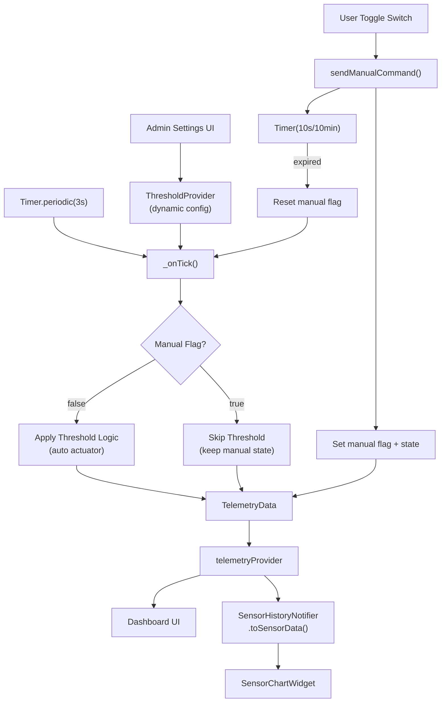

# Refaktor IoT Architecture: Single Source of Truth + Dynamic Thresholds

Refaktor arsitektur state management menjadi unified **TelemetryData** dengan:
- **Dynamic Thresholds** — dikonfigurasi via UI, bukan hardcode
- **Manual Override 10 menit** — single switch, auto-reset via `Timer`
- **Single Source of Truth** — ESP32 simulasi sebagai penentu aktuator

## Proposed Changes

### 1. Domain Layer — Model Data

---

#### [MODIFY] [sensor_data.dart](file:///e:/Kuliah/Semester-4/Aplikasi%20Mobile/SMARTGREENHOUSE/lib/domain/sensor_data.dart)

Tambahkan class `TelemetryData` di file yang sama. `SensorData` **dipertahankan** untuk backward compatibility (chart widget).

```dart
@immutable
class TelemetryData {
  // ── Sensor ──
  final double temperature;
  final double humidity;
  final double soilMoisture;
  final double lightIntensity;
  final DateTime timestamp;

  // ── Actuator State (dari ESP32) ──
  final bool isPumpOn;
  final bool isHumidifierOn;
  final bool isLightOn;

  // ── Manual Override Flags ──
  final bool isPumpManual;
  final bool isHumidifierManual;
  final bool isLightManual;

  /// Konversi ke SensorData untuk chart compatibility
  SensorData toSensorData() => SensorData(...);
}
```

#### [DELETE] [actuator_state.dart](file:///e:/Kuliah/Semester-4/Aplikasi%20Mobile/SMARTGREENHOUSE/lib/domain/actuator_state.dart)

Semua state aktuator kini terintegrasi di `TelemetryData`.

---

### 2. Provider Layer — Threshold Config (NEW)

---

#### [NEW] [threshold_provider.dart](file:///e:/Kuliah/Semester-4/Aplikasi%20Mobile/SMARTGREENHOUSE/lib/providers/threshold_provider.dart)

Model + Notifier untuk konfigurasi threshold dinamis:

```dart
@immutable
class ThresholdConfig {
  // ── Soil Moisture → Pompa ──
  final double soilMoistureMin;  // default: 40.0 (< min → pump ON)
  final double soilMoistureMax;  // default: 60.0 (> max → pump OFF)

  // ── Temperature → Humidifier ──
  final double temperatureMin;   // default: 28.0 (< min → humidifier OFF)
  final double temperatureMax;   // default: 33.0 (> max → humidifier ON)

  // ── Light → Lampu ──
  final double lightMin;         // default: 300.0  (< min → light ON)
  final double lightMax;         // default: 600.0  (> max → light OFF)
}

class ThresholdNotifier extends Notifier<ThresholdConfig> {
  ThresholdConfig build() => const ThresholdConfig(); // defaults
  
  void updateSoilMoisture({double? min, double? max}) { ... }
  void updateTemperature({double? min, double? max}) { ... }
  void updateLight({double? min, double? max}) { ... }
  void resetToDefaults() { ... }
}

final thresholdProvider = NotifierProvider<ThresholdNotifier, ThresholdConfig>(...);
```

> [!NOTE]
> **Hysteresis logic**: Setiap threshold punya `min` dan `max` membentuk dead-zone. Contoh: soil moisture < 40% → pompa ON, > 60% → pompa OFF, 40-60% → pertahankan state sebelumnya. Ini mencegah aktuator "berkedip" saat sensor berada di ambang batas.

---

### 3. Provider Layer — Telemetry Refactor

---

#### [MODIFY] [dashboard_provider.dart](file:///e:/Kuliah/Semester-4/Aplikasi%20Mobile/SMARTGREENHOUSE/lib/providers/dashboard_provider.dart)

**Hapus:**
- `ActuatorNotifier` + `actuatorProvider`
- `_sensorDataStream()` function lama  
- `sensorDataProvider` lama (StreamProvider)

**Tambah:**

```dart
class TelemetryNotifier extends Notifier<TelemetryData> {
  Timer? _tickTimer;
  
  // Manual override timers (satu per aktuator)
  Timer? _pumpManualTimer;
  Timer? _humidifierManualTimer;
  Timer? _lightManualTimer;

  TelemetryData build() {
    // Start tick setiap 3 detik
    _tickTimer = Timer.periodic(Duration(seconds: 3), (_) => _onTick());
    ref.onDispose(() => _cancelAllTimers());
    return TelemetryData(/* defaults */);
  }

  void _onTick() {
    final threshold = ref.read(thresholdProvider);
    // 1. Generate random sensor values
    // 2. Apply threshold logic (SKIP jika manual flag true)
    // 3. state = new TelemetryData(...)
  }

  /// UI memanggil ini saat switch di-toggle.
  void sendManualCommand(String actuator, bool targetState) {
    // 1. Set aktuator state = targetState
    // 2. Set manual flag = true
    // 3. Cancel timer manual lama untuk aktuator ini
    // 4. Start Timer baru:
    //    Timer(Duration(seconds: 10), () {  // TODO: Ubah ke 10 menit untuk production
    //      Reset manual flag = false
    //    });
  }
}

final telemetryProvider = NotifierProvider<TelemetryNotifier, TelemetryData>(...);
```

**Adaptasi existing providers:**

```dart
// SensorHistoryNotifier — listen ke telemetryProvider, konversi via .toSensorData()
class SensorHistoryNotifier extends Notifier<List<SensorData>> {
  List<SensorData> build() {
    ref.listen(telemetryProvider, (prev, next) {
      // append next.toSensorData() ke history
    });
    return <SensorData>[];
  }
}

// Backward-compatible provider untuk chart (tidak perlu ubah chart widget)
// sensorHistoryProvider tetap menyediakan List<SensorData>
```

**Data Flow:**



---

### 4. UI Layer — Dashboard & Widgets

---

#### [MODIFY] [actuator_card.dart](file:///e:/Kuliah/Semester-4/Aplikasi%20Mobile/SMARTGREENHOUSE/lib/presentation/widgets/actuator_card.dart)

Perubahan minimal:
- Tambah parameter opsional `bool isManualOverride` (default: `false`)
- Jika `isManualOverride == true`, tampilkan indikator kecil:
  - Dot kuning kecil di pojok card, atau
  - Teks kecil "Manual" di bawah label aktuator
- Switch tetap satu, `onToggle` callback tidak berubah signature

#### [MODIFY] [dashboard_screen.dart](file:///e:/Kuliah/Semester-4/Aplikasi%20Mobile/SMARTGREENHOUSE/lib/presentation/screens/dashboard_screen.dart)

**Perubahan utama:**

1. **Import**: Hapus `actuator_state.dart`, tambah `threshold_provider.dart`
2. **`build()`**:
   - `ref.watch(telemetryProvider)` menggantikan `actuatorProvider` dan `sensorDataProvider`
   - Satu `telemetry` object untuk semua UI
3. **AppBar**: 
   - Tambah `IconButton(Icons.tune)` untuk buka Threshold Settings
   - `isConnected` → `true` (stream aktif = online)
4. **`_buildActuatorRow()`**:
   - Baca `isPumpOn`, `isHumidifierOn`, `isLightOn` dari `telemetry`
   - `onToggle` → `sendManualCommand('pump', !telemetry.isPumpOn)`
   - Pass `isManualOverride: telemetry.isPumpManual` ke `ActuatorCard`
5. **`_buildSensorExpansion()`**: 
   - Langsung baca dari `telemetry` (bukan `AsyncValue.when`)
6. **`_showThresholdSettings()`** — **NEW** — `showModalBottomSheet` Material 3:
   - Container dengan drag handle
   - 3 section (Soil Moisture, Temperature, Light)
   - Setiap section: `RangeSlider` untuk min/max
   - Bind ke `thresholdProvider.notifier`
   - Tombol "Reset Default"

#### [NO CHANGE] [sensor_chart_widget.dart](file:///e:/Kuliah/Semester-4/Aplikasi%20Mobile/SMARTGREENHOUSE/lib/presentation/widgets/sensor_chart_widget.dart)

Tidak perlu diubah — `sensorHistoryProvider` tetap menyediakan `List<SensorData>`.

#### [NO CHANGE] [sensor_card.dart](file:///e:/Kuliah/Semester-4/Aplikasi%20Mobile/SMARTGREENHOUSE/lib/presentation/widgets/sensor_card.dart)

Tidak perlu diubah.

---

## Ringkasan File Changes

| File | Action | Alasan |
|------|--------|--------|
| `lib/domain/sensor_data.dart` | MODIFY | Tambah `TelemetryData` class |
| `lib/domain/actuator_state.dart` | DELETE | Digantikan oleh `TelemetryData` |
| `lib/providers/threshold_provider.dart` | NEW | Dynamic threshold config |
| `lib/providers/dashboard_provider.dart` | MODIFY | `TelemetryNotifier` + hapus `ActuatorNotifier` |
| `lib/presentation/widgets/actuator_card.dart` | MODIFY | Tambah `isManualOverride` indicator |
| `lib/presentation/screens/dashboard_screen.dart` | MODIFY | Baca dari `telemetryProvider` + threshold settings UI |

---

## User Review Required

> [!IMPORTANT]
> **Manual Override Timer**: 10 **detik** untuk testing, dengan komentar `// TODO: Ubah ke Duration(minutes: 10) untuk production`. Confirm?

> [!IMPORTANT]  
> **`isEspConnected` dihapus**: Selama stream timer aktif = "Online". Jika nanti integrasikan MQTT asli, field ini bisa ditambahkan kembali. OK?

> [!IMPORTANT]
> **Threshold Bottom Sheet hanya untuk Admin?** Saat ini plan tidak membedakan role untuk akses settings. Apakah perlu RBAC check (hanya Admin yang bisa melihat tombol settings)?

## Verification Plan

### Automated Tests
```bash
flutter analyze lib/
```

### Manual Verification
1. **Auto mode**: Sensor random memicu aktuator otomatis sesuai threshold
2. **Manual override**: Toggle switch → label "Manual" muncul → setelah 10 detik kembali "Auto"
3. **Dynamic threshold**: Buka settings → geser slider → aktuator berubah sesuai threshold baru
4. **Chart**: Grafik tetap berjalan normal
5. **No regressions**: Navigasi User Management, login/logout tetap OK
